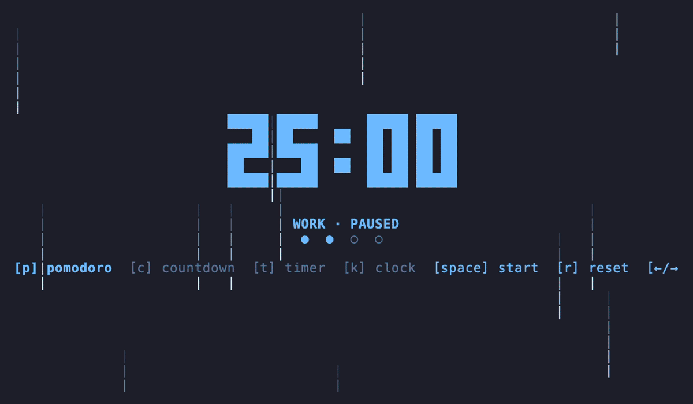

# Saucer

A terminal-based Pomodoro / countdown / timer / clock app. Big block-digit display, seven color themes, an optional
ambient background animation (rain, a self-playing snake, or a self-playing tetris), and live state shared across
multiple running windows. Built with [Bubble Tea](https://github.com/charmbracelet/bubbletea) +
[Lipgloss](https://github.com/charmbracelet/lipgloss).



## Features

- Four modes: **Pomodoro**, **Countdown**, **Timer** (stopwatch), **Clock**.
- Big time readout rendered as 5×5 dot-matrix block digits (no plain terminal text — reads as genuinely large).
- Seven color themes, cycled live with `Tab` / `Shift+Tab`: ocean, sunset, matrix, banana, bubblegum, vaporwave, toxic.
- Optional ambient background animation — off / rain / snake / tetris — cycled with `w`. Snake and tetris are
  self-playing, deterministic simulations (no player input) that loop forever, matching rain's ambient feel.
- Three display levels, cycled with `b`: **full** (everything), **compact** (hides the bottom bar, keeps 2 lines
  below the digits scoped to the current mode — status + round dots in Pomodoro, status + adjust-duration hint in
  Countdown, status only in Timer, date + clock in Clock mode), and **very compact** (just the big digits, nothing
  else).
- Pomodoro phase completion fires a terminal bell and a best-effort macOS desktop notification (via `osascript`; a
  silent no-op on other platforms).
- Pomodoro/Countdown/Timer state is shared live across every concurrently running instance (via a session file), so
  starting a timer in one window shows it running in another.
- Last-used mode, theme, background animation, and compact level persist across restarts.

## Install

Via Homebrew (macOS, arm64 and amd64):

```sh
brew install ldreux/saucer/saucer
```

### Troubleshooting: "cannot be opened because the developer cannot be verified"

`saucer` binaries are ad-hoc signed but not notarized by Apple (notarization requires a
paid Apple Developer Program membership). If you downloaded the release tarball directly
from GitHub (rather than via `brew install`), macOS may flag the binary on first run. To
resolve:

```sh
xattr -d com.apple.quarantine ./saucer
```

or, via Finder: right-click the binary → **Open** → **Open** again in the confirmation dialog.

### Build from source

Requires Go (version pinned in `go.mod`). [Task](https://taskfile.dev) is used for build automation but isn't
required — plain `go build` works too.

```sh
task build      # compile ./bin/saucer
task run        # go run . directly, no binary
task install    # go install to $GOBIN
task test       # go test ./...
task vet        # go vet ./...
task fmt        # gofmt -l -w .
```

Without Task:

```sh
go build -o bin/saucer .
```

## Usage

```sh
./bin/saucer [--theme <name>] [--no-footer]
```

- `--theme` — one of `ocean, sunset, matrix, banana, bubblegum, vaporwave, toxic` (default: last used theme, or
  `ocean` on first run).
- `--no-footer` — start with the bottom bar hidden.

## Keyboard shortcuts

| Key                   | Action                                                                                                            |
|-----------------------|-------------------------------------------------------------------------------------------------------------------|
| `Space`               | Start/pause the current mode's timer (no-op in Clock)                                                             |
| `r`                   | Reset the current mode (Pomodoro → Work, round 1; Countdown → full duration; Timer → 0)                           |
| `p` / `c` / `t` / `k` | Switch to Pomodoro / Countdown / Timer / Clock                                                                    |
| `←` / `→`             | Pomodoro only: manually switch Work ↔ Break phase (round counter unaffected)                                      |
| `↑`/`+`, `↓`/`-`      | Countdown: adjust duration ±1 min (only while paused). Pomodoro: adjust remaining time ±1 min (running or paused) |
| `b`                   | Cycle display level: full → compact (hides bottom bar, keeps 2 mode-scoped info lines) → very compact (big digits only) |
| `w`                   | Cycle ambient background animation: off → rain → snake → tetris → off                                             |
| `Tab` / `Shift+Tab`   | Cycle color theme forward/backward                                                                                |
| `q` / `Ctrl+C`        | Quit                                                                                                              |

## Modes

- **Pomodoro** — 25:00 work / 5:00 break / 15:00 long break every 4th round, with a row of 4 round-progress dots
  (`●`/`○`). On completion, the phase auto-advances, the timer pauses, and the display flashes red and blinks —
  indefinitely, until acknowledged with `Space`, `r`, or `←`/`→` — alongside a bell and desktop notification.
- **Countdown** — counts down from a user-settable duration (default 10:00, adjustable 1:00–99:00 in 1-minute steps
  while paused). On reaching zero, flashes red for ~4 seconds, then settles into `COUNTDOWN · DONE`.
- **Timer** — stopwatch counting up from zero, no target.
- **Clock** — live local time and date, always running, no start/pause/reset.

## State files

Two separate files under the OS config dir (e.g. `~/Library/Application Support/saucer/` on macOS):

- `state.json` — per-user preferences (mode, theme, background animation, compact level), read once at startup and
  written on keypress.
- `session.json` — the live, shared Pomodoro/Countdown/Timer state, polled continuously and written on every
  transition so concurrently running instances stay in sync.

Both are best-effort: a missing or corrupt file is treated as "nothing saved yet" rather than a startup failure.

## Project layout

- `main.go` — CLI flags and program entry point; wires up `internal/app`.
- `internal/app/model.go` — Bubble Tea `Model`, timing logic, key handling.
- `internal/app/view.go` — rendering: layout, status text, footer.
- `internal/app/bigfont.go` — 5×5 dot-matrix digit/colon glyphs for the big time display.
- `internal/app/canvas.go` — per-cell buffer compositing foreground text over the background animation.
- `internal/app/bganim.go` — ambient rain effect plus the background-animation dispatcher/shared color helpers.
- `internal/app/snake.go` — self-playing snake background animation.
- `internal/app/tetris.go` — self-playing tetris background animation.
- `internal/app/theme.go` — color theme definitions.
- `internal/app/state.go` / `internal/app/session.go` — persisted preferences and shared live session, respectively.
- `internal/app/notify.go` — bell + macOS desktop notification on Pomodoro completion.
- `bin/` — build output (gitignored), e.g. `bin/saucer`.
